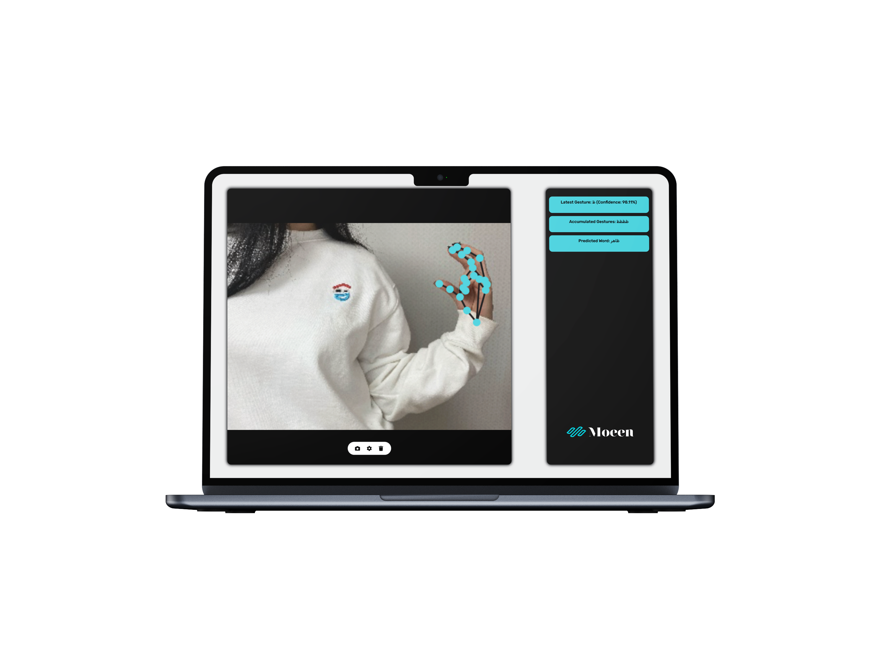

<center>

</center>

# Moeen-App

Moeen ( مُعين ) is an AI powered web application that can translate arabic sign language into speech, This project, developed as part of the **GDG DevFest24 Hackathon**, aims to bridge communication gaps for the deaf and hard-of-hearing community by converting sign language gestures into text and speech in real time. The application uses machine learning models for gesture recognition and integrates with text-to-speech services to provide an interactive experience.

For gestures refrer to this [Image](https://github.com/itsmoe15/Moeen-App/blob/main/static/img/refrence.jpg)

## 🚀 Features

- **Real-time Gesture Recognition**: Uses MediaPipe's GestureRecognizer to detect sign language gestures from video input.
- **Text Prediction**: Sends gesture data to a server (Flask app) for word prediction based on accumulated gestures.
- **Text-to-Speech (TTS)**: Converts the predicted words into speech using ElevenLabs API.
- **Webcam Integration**: Allows users to interact with the app using their webcam to capture sign language gestures.

## 🏆 Achievements

- **Second Place** at the **Assiut GDG DevHack24 Hackathon**.

<center>

</center>

  
## 🔮 Future Plans

We are planning to enhance the system with an LSTM (Long Short-Term Memory) model for more accurate predictions and better word/sentence translation. This will allow the app to:
- **Translate Whole Words**: Detect and convert complete words from gestures.
- **Recognize 503 Words and 40 Sentences**: Expand the dictionary and sentence structure to cover a wider range of gestures.
- **Improved Accuracy**: The LSTM model will help in improving predictions by using past context (gestures and words).

## 💻 Installation

To run this project locally, follow these steps:


### Clone the repository

```bash
git clone https://github.com/itsmoe15/Moeen-App
cd sign-language-translator
```

### Backend Setup

1. Install Python dependencies:

```bash
pip install -r requirements.txt
```

2. Save your API keys to the `.env.tmp` file, then rename it to `.env`:

```bash
GEMINI_API_KEY=your_gemini_api_key
ELEVENLABS_API_KEY=your_elevenlabs_api_key
```

3. Run the Flask app:

```bash
python app.py
```

Once thats done, open your browser and go to `http://localhost:5000` to interact with the application.


## 🧑‍💻 Contributing

We welcome contributions to improve the project! If you'd like to contribute, please follow these steps:

1. Fork the repository.
2. Create a new branch (`git checkout -b feature-name`).
3. Make your changes and commit them (`git commit -am 'Add new feature'`).
4. Push to the branch (`git push origin feature-name`).
5. Open a pull request.

We hope this app helps improve communication and understanding for the deaf and hard-of-hearing community. Thank you for your interest in our project! 💙
## 📜 License

This project is licensed under the GNU GENERAL PUBLIC LICENSE - see the [LICENSE](LICENSE) file for details.

---


